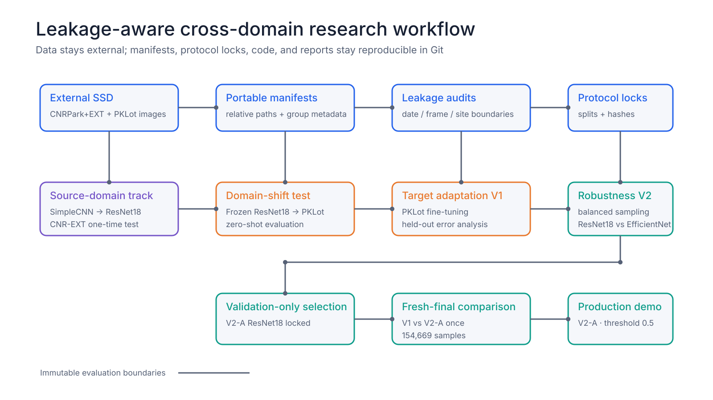

# Cross-Domain Parking Occupancy Detection

## 基於遷移學習與洩漏防護協議的跨場域停車格占用辨識

A reproducible computer-vision study of source-domain learning, zero-shot domain
shift, target adaptation, error analysis, and precommitted robustness
evaluation. 本專題以可重現、可稽核的方式研究單一停車格裁切影像的
`EMPTY`／`OCCUPIED` 分類，以及模型跨停車場時的泛化與改善策略。

| Final production model | Fresh-final samples | Accuracy | Occupied F1 | UFPR04 recall |
|---|---:|---:|---:|---:|
| **V2-A balanced ResNet18** | 154,669 | **0.998894** | **0.998912** | **1.000000** |

The final model was selected on `v2_validation` only and compared with immutable
V1 exactly once on a disjoint fresh-final protocol. 最終模型未使用 fresh-final
選模；threshold、前處理與 evaluation code 在開啟前已鎖定。


## Project Overview / 專題概述

The system classifies one already cropped parking space as `EMPTY` or
`OCCUPIED`. The research asks whether transfer learning improves a from-scratch
baseline, how severely performance changes across parking lots, whether
target-domain adaptation helps, and how a documented site-specific weakness can
be improved without tuning on analyzed held-out errors.

系統輸入為單一已裁切停車格，不包含整張停車場的車位定位。研究重點涵蓋
SimpleCNN baseline、ResNet18 transfer learning、CNR-EXT in-domain test、PKLot
zero-shot domain shift、target adaptation、error analysis，以及 V2
validation-only selection 與一次性 fresh-final comparison。

## Research Questions / 研究問題

- Can a lightweight SimpleCNN provide a meaningful baseline?
- Does ImageNet-pretrained ResNet18 outperform it on the same grouped split?
- How large is the source-to-target domain shift from CNR-EXT to PKLot?
- Can target-domain adaptation recover performance without crossing evaluation boundaries?
- Which site and error type dominate the remaining failures?
- Can a precommitted V2 protocol improve UFPR04 occupied recall without reducing overall F1?

## Research Workflow / 研究架構



Large datasets live on an external SSD through `PARKING_DATA_ROOT`. The
repository stores portable manifests, group assignments, small configs, hashes,
code, and results—never train/validation/test image copies.

大型資料只存放於外接 SSD；manifest 僅記錄相對路徑與 ID。所有主要 split 依
date、site、source frame 或 camera/slot group 建立，避免相似影像跨 split。

## Research Progression / 研究演進

| Stage | Dataset / boundary | Main result | Research decision |
|---|---|---|---|
| 1. SimpleCNN baseline | CNR-EXT validation, 18,938 | Accuracy 0.980885; F1 0.980611 | Established a small from-scratch baseline |
| 2. ResNet18 transfer learning | Same CNR-EXT validation | Accuracy 0.995248; F1 0.995199 | Transfer learning won on the fair split |
| 3. In-domain evaluation | CNR-EXT one-time test, 19,155 | Accuracy 0.988567; F1 0.988692 | Locked source-domain performance |
| 4. Zero-shot domain shift | PKLot, 695,695 | Accuracy 0.743097; F1 0.788652 | Revealed a 0.200040 F1 drop |
| 5. V1 target adaptation | PKLot held-out, 615,653 | Accuracy 0.986387; F1 0.986545 | Recovered most target-domain performance |
| 6. Error analysis | Same completed V1 held-out result | 8,381 errors; 7,341 FN; UFPR04 recall 0.854565 | Identified a site-specific FN weakness |
| 7. V2 robustness protocol | New disjoint site/date groups | Balanced site/label sampling, mild augmentation, locked gate | Excluded analyzed V1 errors from development |
| 8. V2 candidate selection | `v2_validation`, 42,148 | ResNet18 macro-site F1 0.999489 vs EfficientNet 0.999104 | Selected V2-A using validation only |
| 9. One-time V1 vs V2 | Fresh final, 154,669 | V2-A Accuracy 0.998894; F1 0.998912; UFPR04 recall 1.000000 | Both precommitted robustness gates passed |

Metrics from different rows belong to different protocols and are not a single
leaderboard. 不同階段的數值保留其原始 dataset/split 語境，只有標明相同 split 的
比較才是直接公平比較。

## Model Comparison / 模型比較

### Same CNR-EXT validation split

| Model | Accuracy | Precision | Recall | Occupied F1 |
|---|---:|---:|---:|---:|
| SimpleCNN | 0.980885 | 0.986954 | 0.974348 | 0.980611 |
| ResNet18 transfer learning | **0.995248** | **0.997434** | **0.992975** | **0.995199** |

### V2 validation-only selection

| Candidate | Accuracy | Occupied F1 | Macro-site F1 | Minimum-site recall |
|---|---:|---:|---:|---:|
| V2-A balanced ResNet18 | **0.999478** | **0.999401** | **0.999489** | **0.999512** |
| V2-B balanced EfficientNet-B0 | 0.998909 | 0.998748 | 0.999104 | 0.998048 |

### Same locked fresh-final set

| Model | Accuracy | Precision | Recall | Occupied F1 | Macro-site F1 | UFPR04 recall | FP | FN |
|---|---:|---:|---:|---:|---:|---:|---:|---:|
| V1 target-adapted ResNet18 | 0.991834 | 0.998594 | 0.985315 | 0.991910 | 0.973232 | 0.859053 | 109 | 1,154 |
| **V2-A balanced ResNet18** | **0.998894** | **0.998766** | **0.999058** | **0.998912** | **0.998763** | **1.000000** | **97** | **74** |

Full boundary-aware tables are in the [model comparison report](docs/MODEL_COMPARISON.md).

## Domain Shift / 跨場域落差


The frozen source ResNet18 lost 0.245470 accuracy and 0.200040 occupied F1 when
moved from the CNR-EXT test to PKLot without target adaptation. This result
motivated the adaptation track; it was not overwritten by later improvements.

## V1 → V2 Robustness Improvement / 穩健性改善


The precommitted gate required at least +0.02 absolute UFPR04 occupied-recall
gain and no more than -0.005 overall occupied-F1 degradation. Observed changes
were +0.140947 and +0.007002 respectively, so both conditions passed.

## Error Analysis Summary / 錯誤分析摘要

On the completed 615,653-sample V1 held-out evaluation:

- Confusion matrix: `[[300027, 1040], [7341, 307245]]`
- 8,381 total errors: 1,040 false positives and 7,341 false negatives
- UFPR04 contributed 6,117 false negatives and 73.08% of all errors
- UFPR04 occupied recall was 0.854565, versus above 0.995 for PUC and UFPR05
- Sunny metadata covered 68.58% of errors, but weather is confounded with site/date and is not interpreted causally
- Visual inspection found possible annotation/crop ambiguities; no labels were changed

The analyzed error manifest, aggregate analysis, and contact sheets were
explicitly forbidden as V2 training or selection inputs. See
[Error Analysis](docs/ERROR_ANALYSIS.md).

## Final Production Demo / 最終展示

The existing Streamlit interface now accepts only the selected V2-A checkpoint
format. It keeps the original single-image layout and unchanged inference
contract.

```bash
python -m pip install -r requirements.txt
export PARKING_MODEL_PATH="/absolute/path/to/v2a_balanced_resnet18.pt"
streamlit run app/app.py
```

If `PARKING_MODEL_PATH` is unset, the app uses
`models/v2a_balanced_resnet18.pt`. It verifies the selected candidate,
architecture, and locked experiment-config hash before loading.

- Input: one cropped JPEG, PNG, or WebP image, up to 10 MB
- Preprocessing: edge-pad → 224×224 bilinear resize → ImageNet normalization
- Decision threshold: occupied probability ≥ 0.5
- Output: `EMPTY`/`OCCUPIED`, confidence, and both class scores
- Dataset access: not required; uploads remain in memory

See the [final V2-A demo guide](docs/FINAL_DEMO.md). The original Milestone 10
V1 demo documentation and images remain preserved as historical artifacts.

## Datasets and Storage / 資料與儲存

- Source-domain dataset: CNRPark+EXT
- Target-domain dataset: PKLot
- Labels: `0 = EMPTY`, `1 = OCCUPIED`
- Large archives/extractions: external SSD only
- Repository `data/`: metadata, manifests, summaries, and small configs only

```bash
export PARKING_DATA_ROOT="/absolute/path/to/external-ssd/parking-datasets"
python -m src.data_paths
```

No machine-specific `/Volumes/...` path is committed. No physical
train/validation/test image-copy folders are created.

## Reproducibility and Boundaries / 可重現性與邊界

- Deterministic group assignments and recorded random seeds
- Exact JSON configurations and training histories
- Checkpoint, manifest, config, selection-lock, and result SHA-256 values
- V1 completed results preserved without reinterpretation
- V2 trained on `v2_train` only and selected on `v2_validation` only
- Fresh final opened exactly once for two immutable ResNet18 checkpoints
- No retraining, threshold calibration, candidate switching, or post-final update
- 23 automated tests covering data paths, splits, metrics, models, inference, and gates

Selected checkpoint SHA-256:
`97b039fa7d4125e993903c4d1b485a7bc8e58d47cf7917c5fef8515e6982d5f9`.

## Tech Stack / 技術工具

- Python, PyTorch, torchvision
- OpenCV, Pillow, NumPy, Pandas, scikit-learn
- Transfer learning, domain adaptation, grouped evaluation protocols
- SimpleCNN, ResNet18, EfficientNet-B0
- Streamlit, unittest, Git, GitHub
- Apple MPS and CPU inference

## Repository Structure / 專案結構

```text
parking-occupancy-detection/
├── app/          # Streamlit single-crop demo
├── data/         # Portable metadata, manifests, locks, and small config
├── docs/         # Experiment reports and application materials
├── images/       # Charts, contact sheets, screenshots, GIF, and QR code
├── models/       # Local ignored checkpoints
├── results/      # Exact experiment and evaluation JSON
├── src/          # Data, training, evaluation, inference, and asset tooling
└── tests/        # Automated tests
```

## Portfolio Materials / 作品集文件

- [Final research summary / 最終研究摘要](docs/FINAL_RESEARCH_SUMMARY.md)
- [Graduate-application abstract / 研究所備審摘要](docs/GRADUATE_APPLICATION_ABSTRACT.md)
- [CV description and technical skills / 履歷描述與技術能力](docs/CV_PROJECT_DESCRIPTION.md)
- [Complete model comparison / 完整模型比較](docs/MODEL_COMPARISON.md)
- [V2 training and selection](docs/V2_TRAINING_SELECTION.md)
- [One-time fresh-final comparison](docs/V2_FRESH_FINAL_COMPARISON.md)
- [Final demo guide](docs/FINAL_DEMO.md)

## Limitations / 限制

- This is crop classification, not full-frame parking-space detection.
- CNRPark+EXT covers one physical lot; camera holdout is not cross-location proof.
- Softmax confidence is uncalibrated.
- Weather, site, and date are confounded; reported associations are not causal.
- Fresh final is disjoint from V1 adaptation and V2 development, but PKLot images had historically received V1 inference before the V2 protocol.
- Model weights and large datasets are intentionally excluded from Git.
- The fresh-final result is closed and cannot support another model revision.

## Project Status / 專案狀態

**Milestone 11 — Portfolio Finalization: complete.**

Final production model: `models/v2a_balanced_resnet18.pt`. No new modeling,
retraining, recalibration, or fresh-final reopening was performed during
portfolio finalization.

## Repository QR Code

[](https://github.com/mieuxwei/parking-occupancy-detection)

Scan to open the GitHub repository. 掃描 QR code 可開啟本專題 repository。
