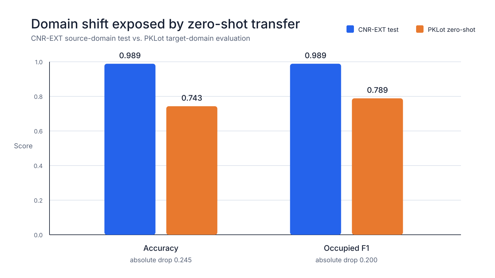
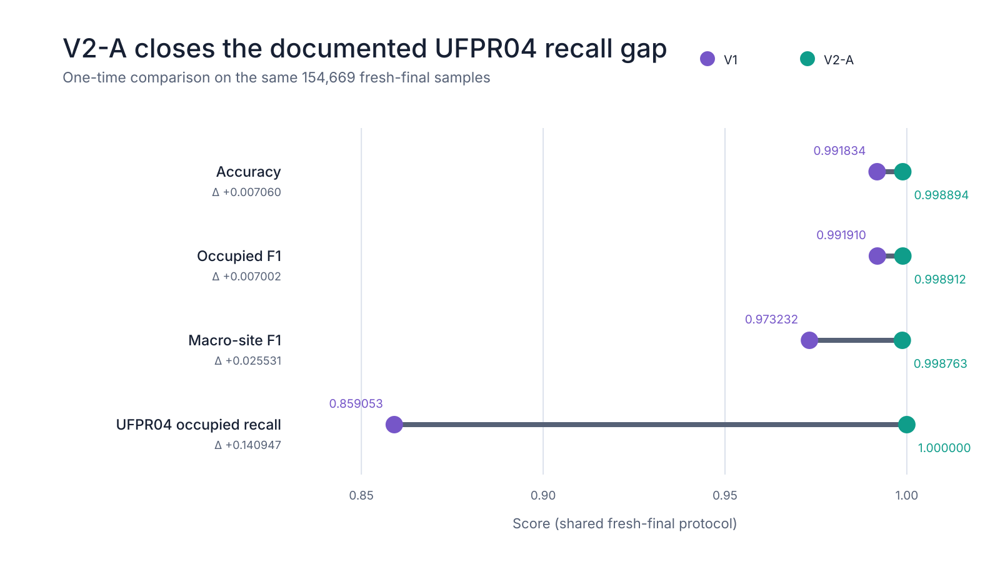
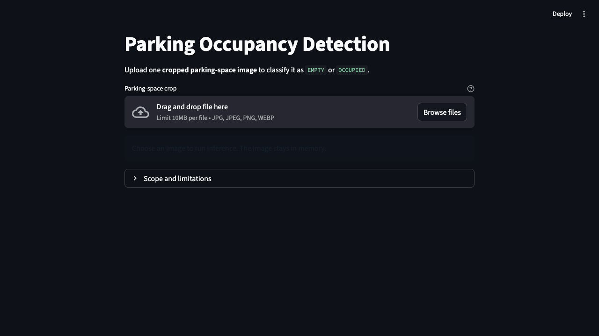

# Cross-Domain Parking Occupancy Detection

### Single-crop parking-space occupancy classification

**Independent AI Research Project · Completed and Frozen**

個人自主 AI 研究作品｜已完成並凍結

A leakage-aware PyTorch study of cross-domain parking-space occupancy
classification from CNRPark+EXT to PKLot.

以 PyTorch 建立具資料洩漏防護的跨場域停車格占用分類研究，
分析跨場域落差、目標場域適應與場域穩健性。

**Scope:** Classification of a pre-cropped parking-space image as `EMPTY` or
`OCCUPIED`. No parking-space localization, full-lot detection, or live CCTV.
不包含車位定位、完整停車場影像偵測或即時 CCTV 監控。

[🚀 Live Demo](https://parking-occupancy-detection-hk9l6wzyvtkrqjr6tkvftc.streamlit.app/) ·
[Project Summary](docs/FINAL_RESEARCH_SUMMARY.md) ·
[中文技術總覽](docs/PROJECT_OVERVIEW_AND_STATUS.md) ·
[Reproduction](docs/REPRODUCTION.md)

## Core Results / 核心成果

| Question and evaluation boundary | Locked result |
|---|---|
| Same frozen source ResNet18, **different domains**: CNR-EXT test (19,155) → PKLot zero-shot (695,695) | Occupied F1 **0.988692 → 0.788652** |
| Final V2-A, **154,669 fresh-final samples** | Accuracy **0.998894**; occupied F1 **0.998912** |
| V1 → V2-A, **same fresh-final set**, UFPR04 subset | Occupied recall **0.859053 → 1.000000** |

These are separate evaluation contexts, not one model leaderboard.
不同場域與 split 的結果不可混為單一排名；V1／V2-A 才是在同一 fresh-final set 上比較。

## Domain Shift



The same frozen source model lost **0.200040 occupied F1** on zero-shot transfer.
This cross-domain comparison exposed the problem; it is not a ranking of two
models on the same test set. [Protocol and evidence](docs/CROSS_DOMAIN_EVALUATION.md).

## V1 → V2 Robustness



V1 adaptation recovered much of the target-domain performance, but error
analysis exposed a false-negative concentration at UFPR04. V2 precommitted
site/label-balanced sampling, mild augmentation, and validation-only selection
between ResNet18 and EfficientNet-B0. The analyzed V1 errors were not development
inputs; EfficientNet-B0 never entered fresh final.

The selected V2-A passed both locked gates on the **same 154,669 samples**:
UFPR04 recall improved by **+0.140947** (required ≥ +0.02), and occupied F1
improved by **+0.007002** (allowed degradation no worse than −0.005).
[Full comparison](docs/MODEL_COMPARISON.md) ·
[One-time final record](docs/V2_FRESH_FINAL_COMPARISON.md).

## Demo and Local Use

[**🚀 Open the Live Demo**](https://parking-occupancy-detection-hk9l6wzyvtkrqjr6tkvftc.streamlit.app/)



The GIF is a recorded fallback; the current interface also includes
**Try a Sample** with ten demonstration images and **Upload Your Own**.
Samples are demonstration material, **not evaluation evidence**.

Upload one cropped JPEG, PNG, or WebP (maximum 10 MB). The app displays
`EMPTY`/`OCCUPIED`, predicted-class confidence, and both class scores.
Uploads stay in memory. Scores are uncalibrated softmax outputs.

If the hosted app is sleeping or unavailable, use the GIF above, the
[screenshot](images/v2_demo_inference_result.png), or run locally with Python 3.11:

```bash
python -m venv .venv
source .venv/bin/activate
python -m pip install -r app/requirements.txt
streamlit run app/app.py
```

**Final frozen demo model:** `models/v2a_balanced_resnet18.pt`.
Its SHA-256, selected candidate, architecture, and config hash are checked at
load time. CPU inference needs no dataset, external SSD, login credential, or
API key. [Locked demo inference contract](docs/FINAL_DEMO.md).

## Quick Project Tour / 快速導覽

- [Project Abstract / 專案摘要](docs/PROJECT_ABSTRACT.md) — problem, method, findings, limitations.
- [Project Highlights / 專案重點](docs/PROJECT_HIGHLIGHTS.md) — technical contributions and implementation.
- [Research summary and nine-stage progression](docs/FINAL_RESEARCH_SUMMARY.md) — SimpleCNN through locked V2-A.
- [Model comparison](docs/MODEL_COMPARISON.md) — full tables with dataset/split boundaries.
- [Error analysis](docs/ERROR_ANALYSIS.md) — V1's 8,381 errors, including 7,341 false negatives.
- [Reproduction and evidence](docs/REPRODUCTION.md) — safe checks, configs, manifests, hashes, and historical records.
- [中文技術總覽](docs/PROJECT_OVERVIEW_AND_STATUS.md) · [Documentation index](docs/README.md).

## Technical Approach

- **PyTorch / torchvision:** SimpleCNN baseline, ImageNet ResNet18 transfer
  learning, target adaptation, and one controlled EfficientNet-B0 candidate.
- **Data and evaluation:** grouped date/site/source-frame splits, balanced
  sampling, occupied and macro-site metrics, error analysis, precommitted gates.
- **Software:** modular Python, NumPy, Pillow/OpenCV image tooling, Streamlit,
  portable synthetic-fixture unit tests, and Linux CPU CI configuration.

## Reproducibility and Freeze

Configs, seeds, training histories, manifests, and SHA-256 locks preserve the
research trail. V2 trained only on `v2_train` and was selected only on
`v2_validation`. Fresh final is complete and closed: no retraining, reselection,
threshold adjustment, or final-set reopening.

The repository keeps **only the final frozen demo checkpoint**:
44,790,987 bytes (42.72 MiB, approximately 43 MiB). It is intentionally in normal
Git so a clone can run the demo immediately; no Git LFS migration or other
weights are included. Dataset archives remain excluded.

Checkpoint SHA-256:
`97b039fa7d4125e993903c4d1b485a7bc8e58d47cf7917c5fef8515e6982d5f9`.

The [Linux CPU workflow](.github/workflows/cpu-tests.yml) runs the existing
unit tests without datasets or training. No passing badge is claimed before a
successful run on the published commit. Research is frozen; ordinary software
and documentation maintenance remain possible.

## Limitations

- Single-crop classification only—not localization, full-frame detection, or
  operational parking-lot monitoring.
- CNRPark+EXT represents one physical parking area; camera holdout is not
  cross-location proof.
- Softmax scores are uncalibrated; site/date/weather associations are not causal.
- Fresh final is disjoint from V1 adaptation and V2 development, but the PKLot
  images had historically received V1 inference before that protocol.
- The final result cannot support another model revision.

研究已凍結；高分不代表完整停車場偵測能力，也不代表所有未知場域皆能維持相同表現。

## Data and License

Large CNRPark+EXT and PKLot images live on external storage configured by
`PARKING_DATA_ROOT`; manifests record relative image paths/IDs, not duplicated
train/validation/test images. The demo is independent of this storage.
[Storage documentation](docs/DATA_STORAGE.md).

Code and documentation use the [MIT License](LICENSE). Third-party dataset
terms and image attribution remain separate:
[THIRD_PARTY_NOTICES.md](THIRD_PARTY_NOTICES.md).
